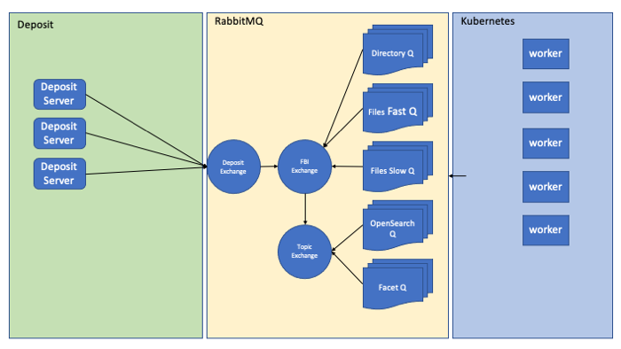

# Rabbit Indexer

This code connects to the RabbitMQ exchange and reads messages created by the deposit server.
These messages are parsed and handlers and initialised to process the events.
DEPOSIT and REMOVE actions are sent to the `ceda-fbi` index and MKDIR, RMDIR, SYMLINK and 00README actions
are sent to the `ceda-dirs` index. 
This is to ensure that the content of the indices matches the archive for use with the archive_browser.

The diagram below is a rough sketch of how the events from the deposit server are picked up by this library.

# Installing

In order to make it easy to set up the correct environment, this codebase should be installed as a package.
This can be done using:

1. Clone the environment `git clone https://github.com/cedadev/rabbit-index-ingest`

2. Install the package `pip install -e <path_to_setup.py>`

# Setup

This code base requires a config file to setup the rabbit server. This is found
in `rabbit_indexer/conf/index_updater.ini`

You will need to set parameters in the `server` and `elasticsearch` sections.

# Running

1. Activate the environment (On ingest machines this is `rabbit_fbi`)
2. `rabbit_event_indexer` or `python rabbit_indexer/scripts/queue_handler.py`